```mermaid
flowchart TD
    A([Start]) --> B[/"Enter/Input a number N"/]
    B --> C[count = 1]
    C --> D{"Is count <= 10?"}

    D -- Yes --> E[Calculate: result = N * count]
    E --> F[/"Display num × count = result"/]
    F --> G[count = count + 1]
    G --> D

    D -- No --> H([End])
```

```mermaid
flowchart TD
    A([Start]) --> B[/"Enter Principal amount P"/]
    B --> C[/"Enter Rate of Int R"/]
    C --> D[/"Enter Time in years T"/]
    D --> E["SI = (P × R × T) / 100"]
    E --> F[/"Display Simple Interest"/]
    F --> G([End])

```

```mermaid
flowchart TD
    A([Start]) --> B[/"Enter length L"/]
    B --> C[/"Enter width W"/]
    C --> D["area = L × W"]
    D --> E[/"Display area"/]
    E --> F([End])

```

# Workshop: Algorithm and Flowchart

For each question in this workshop, you must complete **two** things:

1.  **Write the pseudocode**
2.  **Draw the flowchart** using either
    - **Option 1:** Draw.io (recommended) → export image → upload to
      your repository → link it in this file
    - **Option 2 (optional):** Write a Mermaid flowchart directly in
      Markdown
    - **Option 3 (optional):** Any other valid method

👉 **IMPORTANT:** At the **bottom of each question**, add the
following sections:

### ✔ Pseudocode

### ✔ Flowchart

---

## 1. Check Even or Odd Number

Design an algorithm and flowchart that take a number as input and
determine whether it is even or odd.

### ✔ Pseudocode

```text
START
    INPUT number
    IF number % 2 == 0 THEN
        PRINT Even
    ELSE
        PRINT Odd
    ENDIF
END
```

### ✔ Flowchart


---

## 2. Calculate Total and Average Marks

Write the algorithm and draw the flowchart for a program that inputs
marks for 3 subjects, calculates the total and average, and displays
both.

### ✔ Pseudocode

```text
START
    INPUT marks1, marks2, marks3
    Calculate Toatal: marks1 + marks2 + marks3
    Calculate Average: Total/3
    PRINT Total and Average
END
```

### ✔ Flowchart


---

## 3. Display Multiplication Table

Create an algorithm and flowchart that input a number and display its
multiplication table from 1 to 10 using a loop.

### ✔ Pseudocode

```text
START
    INPUT a number N
    SET count = 1
    REPEAT 10 TIMES
        result = N * count
        PRINT result
        count = count + 1
    ENDREPEAT
END
```

### ✔ Flowchart



---

## 4. Positive, Negative, or Zero Check

Write the algorithm and flowchart to input a number and display whether
it is positive, negative, or zero.

### ✔ Pseudocode

```text
START
    INPUT a number N
    IF N==0
        PRINT Zero
    ELSE IF N>0
        PRINT Positive
    ELSE
        PRINT Negative
    ENDIF

END

```

### ✔ Flowchart


---

## 5. Simple Interest Calculator

Create an algorithm and flowchart for a program that calculates simple
interest using the formula:

**SI = (P × R × T) / 100**

- **P = Principal** → original amount of money
- **R = Rate of Interest** → percentage per year
- **T = Time** → number of years

### ✔ Pseudocode

```text
START
    INPUT Principal amount P
    INPUT Rate of int R
    INPUT Time in year T
        SI = (PxRxT)/100
        DIPLAY SI
END

```

### ✔ Flowchart



---

## 6. Average Temperature Calculation

Write the algorithm and draw the flowchart for a program that takes the
temperature of 7 days, finds the average temperature, and displays it.

```text
START
    SET total = 0, day = 1
    REPEAT 7 TIMES
        INPUT temperature for day (day)
        total = total+temperature
        day = day+1
    ENDREPEAT
        average = total/7
        PRINT average

END

```

### ✔ Flowchart


---

## 7. Calculate Area of a Rectangle

Create an algorithm and flowchart to input length and width, calculate
the area (**Area = Length × Width**), and display the result.

### ✔ Pseudocode

```text
START
    INPUT the lengt L
    INPUT the width W
        area = L x W
        DIPLAY the area
END

```

### ✔ Flowchart



---

## 8. Determine Pass or Fail

Write the algorithm and draw the flowchart for a program that takes a
student's average marks and displays **"Pass"** if average ≥ 50,
otherwise **"Fail"**.

### ✔ Pseudocode

```text
START
    INPUT student's average marks A
    IF average > = 50
        DIPLAY "Pass"
    ElSE
        Display "Fail"
END

```

### ✔ Flowchart


---

## 9. Calculate Factorial of a Number

Write the algorithm and draw the flowchart that input a number and
calculate its factorial using a loop.

---

## 10. Calculate Discount on Purchase

Write the algorithm and draw the flowchart for a program that inputs the
purchase amount and gives a **10% discount** if the amount is greater
than 1000.

---
